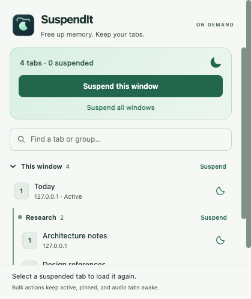
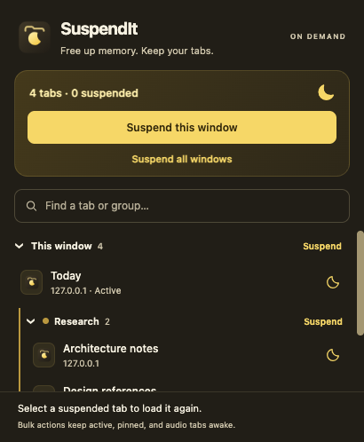

# SuspendIt

[](https://github.com/viseshrp/suspendit/actions/workflows/ci.yml)

Free up memory by suspending individual tabs, Chrome tab groups, a window, or every window.
An English-only popup, a page context menu, and no runtime dependencies.

Suspension uses [`chrome.tabs.discard()`](https://developer.chrome.com/docs/extensions/reference/api/tabs#method-discard).
Chrome keeps the tab in the tab strip and reloads the original page when you select it.

<p>
  
  
</p>

## Install

1. Run `pnpm install --frozen-lockfile` and `pnpm build` with Node.js 22+ and pnpm 10.
2. Open Chrome's Extensions page and enable **Developer mode**.
3. Choose **Load unpacked**, then select `.output/chrome-mv3`.
4. Pin SuspendIt from Chrome's Extensions menu.

CI also produces a `suspendit-extension` ZIP artifact. Extract the ZIP before loading it unpacked.
Requires Chrome 120 or newer.

## Use

- Click the moon beside a tab to suspend it. Search by page title, URL, or group name.
- Collapse windows or groups with their chevrons. Search expands matching sections; clearing it restores your collapsed sections.
- Use a group's or window's **Suspend** button, or **Suspend all windows**. These actions apply to the entire group/window even while searching.
- Right-click a web page and choose **Suspend this tab**.
- Select a suspended tab, or click its title in the popup, to load the original page again.

Search and bulk controls stay visible while the tab list scrolls. Site icons come from Chrome.
Live updates retain existing rows, focus, and scroll position. Browser tests cover 500 and
1,000 tabs; see the [performance checks](docs/TESTING.md#large-tab-sessions).

Bulk actions keep active tabs in every window, pinned tabs, and audio-playing tabs awake.
An individual action can suspend a pinned or audio-playing tab. For an active tab, SuspendIt
selects a nearby existing awake tab in the same window before requesting native discard.
If no awake neighbor exists, that action is unavailable. Browser-internal pages are skipped.

Suspension reloads the page when you return; unsaved in-page state can be lost. Chrome may
refuse an individual discard. Popup results report suspended, skipped, and failed counts.
A failed context-menu action places **!** on the toolbar icon; hover over it for the reason.

## Project structure

| Path | Purpose |
| --- | --- |
| `entrypoints/background/` | Native discard requests and page context menu |
| `entrypoints/popup/` | The only extension page, written in HTML/CSS/TypeScript |
| `entrypoints/shared/` | Tab rules, result text, theme, and reused utility functions |
| `public/icon/` | SVG source and PNGs at 16, 19, 32, 38, 48, 96, and 128 pixels |
| `scripts/`, `tests/`, `.github/workflows/` | Build verification, browser tests, CI and releases |

## Development

Requires Node.js 22+ and pnpm 10.

```sh
pnpm install --frozen-lockfile
pnpm dev
```

```sh
pnpm build       # .output/chrome-mv3
pnpm quality     # TypeScript and Biome
pnpm test        # Unit/integration tests with coverage
pnpm test:e2e    # Production extension in isolated Chromium
pnpm package    # Verified installation ZIP in .output
```

Install the test browser once with `pnpm exec playwright install chromium`.
Run `pnpm icons:generate` to regenerate PNGs from the icon design.
The ZIP is limited to 100 KiB, and all shipped JavaScript together is limited to 32 KiB.

See [testing](docs/TESTING.md), [architecture](docs/architecture.md), [privacy](docs/PRIVACY_POLICY.md),
[memory troubleshooting](docs/troubleshooting.md), and [reused foundations](docs/reuse.md).

## CI and releases

CI checks types/lint, unit/integration coverage, the actual extension in Chromium, manifest
permissions, and package size. Successful `main` builds upload the extension ZIP. Coverage
reports are always available as CI artifacts; Codecov upload runs if `CODECOV_TOKEN` is configured.
Browser artifacts include light/dark screenshots, logs, and the 500/1,000-tab benchmark report.

Push a tag such as `v1.0.0` to create a draft GitHub release. Publishing that draft runs the
checks again, derives the manifest version from the tag, and attaches the installation ZIP.
This follows TabMD/nufftabs' release flow. Chrome Web Store submission remains a separate action.

MIT licensed. See [LICENSE](LICENSE).
